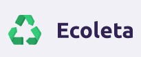
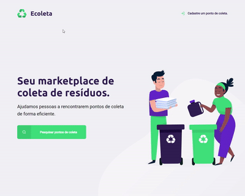

<h1 align="center">
    
</h1>

<h1 align="center">
    
</h1>

# Indice
- [Sobre](#-Sobre)
- [Tecnologias utilizadas](#tecnologias-utilizadas)
- [Como baixar o projeto](#como-baixar-o-porjeto)

---

## 🔖 Sobre

O projeto **Ecoleta** é uma plataforma para empresas que coletam resíduos, materiais recicláveis ou produtos que necessitam de descarte específico. O site foi criado durante o evento **Next Level Week 1.0** da Rocketseat, com a intenção de ensinar através da prática como criar do zero um site, utilizando ferramentas de Front-end e Back-end.

---

## 🚀 Tecnologias utilizadas

O projeto foi desenvolvido utilizando as seguintes tecnologias:

- HTML5
- CSS3
- JavaScript
- Node.js
- Express
- Nunjucks
- SQL

---

## 💻 Como baixar o projeto

```bash

# clonar o repositório
$ git clone https://https://github.com/ThiagoPederzolli/nlw

# entrar no diretório
$ cd nlw

# instalar as dependências
$ npm install express

# instalar o nunjucks
$ npm install nunjucks
```

---
Desenvolvido por © Thiago Pederzolli Machado da Silva
